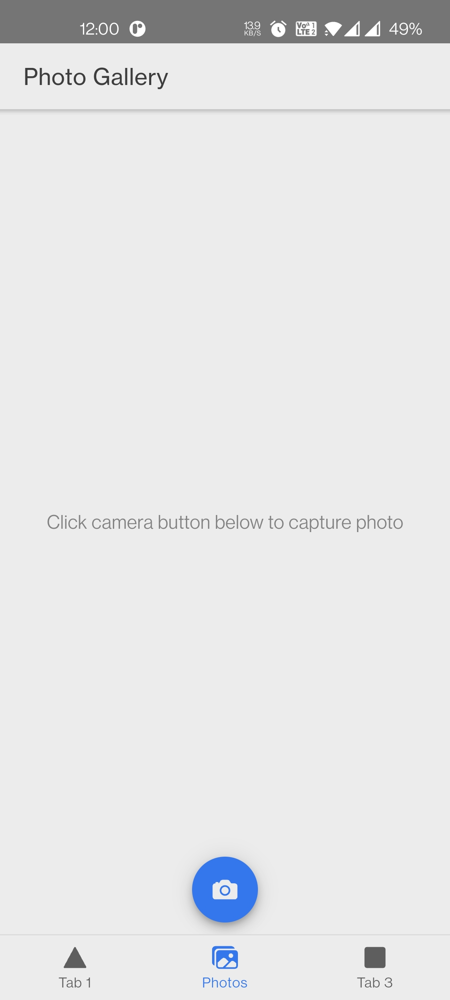

# About

This is a photo taking application. You can do the following:

1. Click photo using Camera API of android/iOS/webcam.

2. Save photo and show the photos in the app itself.

3. Delete selected photos.

# Tech used

This is a PWA (Progressive Web App) which can run both on android and iOS. 

I have used Ionic and Capacitor frameworks to build this app.

# Screehshots

#### 1. Main page

#### 2. Delete image

#### 3. Main page with no images

#### 4. Camera

#### 5. Exit application

